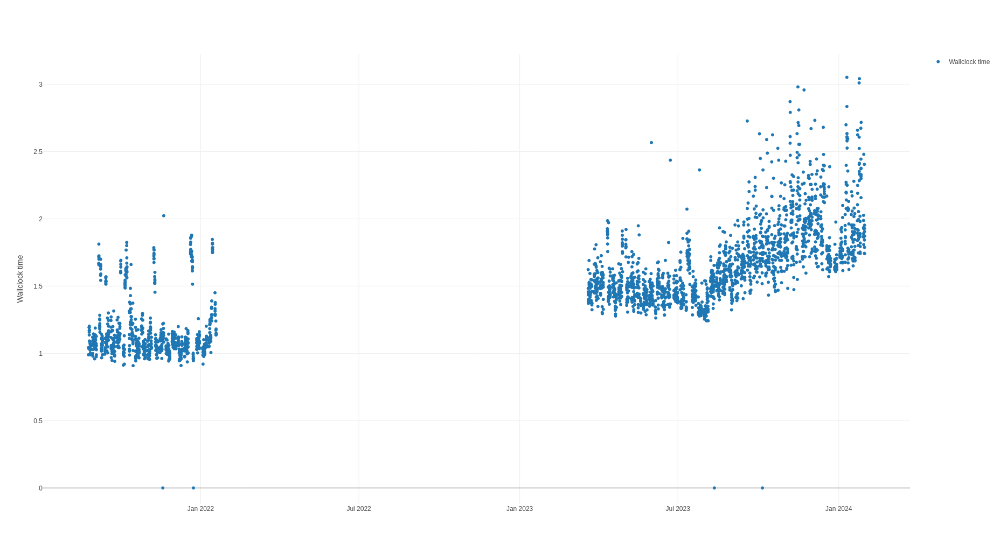

# Tracetool


Tracetool is a "swiss army knife" for analyzing trace files produced by Easit
GO. The trace files are in CSV and JSON format, and are used to track
performance and record diagnostic information. Tracetool helps provide insights
into this data, such as identifying bottlenecks or performance trends. The tool
is developed internally at Easit, evolving based on the emerging needs during
support cases, but is publicly shared on GitHub both as an example of how the
files can be analyzed and as a practical resource for both our team and our
customers.

The main features are plotting and statistics generation. To improve
performance, the tool first imports logs into a local file-based database, which
is then used for most subsequent operations. Import can be done incrementally,
so that only new logs are added to the existing database. Plotting is performed
using the [Plotly](https://plotly.com/graphing-libraries/) library and is
rendered interactively in the default web browser. Statistics are printed to the
console.

The tool is provided "as-is", free of charge, without any obligation on Easit's
part to implement new features or address bugs. While we value feedback and
contributions from our user community, we cannot guarantee updates or support in
line with our main product offerings.

Note that this tool is not the only way to analyze trace files. The files are in
a simple, documented format and can be analyzed using any tool that can read CSV
or JSON files (such as Microsoft Excel, R, or Power BI). Tracetool is provided
as a convenience for those who need high-performance analysis tailored to the
specific content of the trace files. One possible use case is to combine the
import feature of tracetool (to produce a local database) with custom-written
SQL queries to perform complex analysis in a tool such as
[DBeaver](https://dbeaver.io/).

## Features

- Import trace files into a SQLite database for high-performance analysis.
- Plot data from the database using a YAML configuration file.
- Generate statistics for views and forms in Easit GO.
- Search for views matching an SQL query.
- Convert between human-readable units and the internal representation used in
  the trace files.
- Analyze execution overlap between queries.

## Building

If you wish to build the code yourself, ensure you have the Rust toolchain
installed on your system. Clone the repository and navigate to the project
directory. Build the project using Cargo:

```bash
cargo build --release
```

The executable will be located in the `target/release` directory.

## Installing
Binaries are available for download from the releases page. Download the
appropriate binary for your platform and extract the archive. There is no
other installation process; simply run the executable from the command line.

## Usage
For a reference for all subcommands and options, use the `--help` flag:

```bash
tracetool --help
```

```bash
tracetool import --help
```


### Importing Data

Most functions require an SQLite database to be present. To create a new
database, use the `import` command to import data from a trace output directory:

```bash
tracetool import --target mydatabase.db /path/to/trace1 /path/to/trace2
```

This will create a new database file called `mydatabase.db` and import all trace
files from the specified directories. You can provide one or more source
directories. If the database already exists, the tool will append to the
existing data. Note that duplicates are not allowed—you cannot import the same
trace file twice. If you need to re-import a file, you must first delete the
existing database and start over. It is good practice to move existing trace
files out of Easit GO's trace directory before importing them, to prevent
already imported files from receiving additional records. Easit GO will create
new trace files as needed in its output directory.

The database is in SQLite3 format and can be opened using any SQLite client to
perform custom queries. The database schema matches the structure of the source
files as closely as possible, with some additional columns added by subcommands
as described in this documentation.

An ordinal column is added to each table that contains a timestamp, in order to
uniquely identify each record even in the presence of duplicate timestamps. The
primary key for such tables is a combination of the timestamp and the ordinal.
The ordinal is incremented each time a duplicate timestamp is encountered, but
always starts at 0 for each newly encountered timestamp. Hence, most rows will
have an ordinal of 0, but some will have higher values.

Another difference from the text files is that SQL query text is stored separately
from the rest of the data to improve performance and reduce disk-space usage. So
the `item_view_executor_execute` table (which corresponds to the
`cost/ItemViewExecutor.execute.csv` file) has a separate table called
`item_view_executor_execute_query` that contains deduplicated SQL queries. These
are then referenced by ID in the `query` column of the main table.

### Plotting

A primary function of tracetool is to make graphical plots of data from the
trace files. This is done using the `show` command, which takes a YAML
configuration file as argument. The YAML file specifies things such as the data
to be plotted, the axes, and the plot type. The following is an example of a
simple plot configuration:

```yaml
source: ./trace.sqlite
layout:
  width: 1024
  height: 768
  xaxis:
    type: date
  yaxis:
    title: Wallclock time
plots:
  - plot: time_scatter
    name: Wallclock time
    table: item_view_executor_execute
    column: wallclock_time_ns
    filter:
      start: "2023"
      workhours: true
      where: "view_id = 123"
    aggregation:
      mode: median
      size: 1h
    mode: markers
```

See the `examples` directory for more examples of plot configurations. A full
[YAML configuration reference](./docs/plot-config.md) is available. To display a
plot, use the `show` command:

```bash
tracetool show myplot.yaml
```

This will open the default web browser and display the plot. The plot is
interactive and can be zoomed, panned, and hovered over to display additional
information.

### Statistics

Tracetool can also generate statistics from the trace data. The
`view-statistics` and `form-statistics` commands output statistics in CSV format
for each view and form in Easit GO, respectively. This is useful for identifying
performance bottlenecks or to select views and forms for further analysis using
the `show` command.

The statistics are computed from timing records in the
`cost/ItemViewExecutor.execute.csv` and `cost/FormWidget.startup.csv` files. The
columns output by these commands are as follows:

| Column               | Description                  |
|----------------------|------------------------------|
| `form ID`            | The internal ID of the form. |
| `view ID`            | The internal ID of the view. |
| `count`              | The number of records.       |
| `min`                | The minimum time.            |
| `max`                | The maximum time.            |
| `mean`               | The mean time.               |
| `median`             | The median time.             |
| `Q1`                 | The first quartile.          |
| `Q3`                 | The third quartile.          |
| `IQR`                | The interquartile range.     |
| `standard deviation` | The standard deviation.      |

### SQL Query Search
Tracetool can search for views that match an SQL query. This is useful when you
have a problematic query reported by the database and want to find out which
view is the culprit. The `match-query-view` command reads an SQL query from
standard input and outputs the view ID of the matching view. For example:

```bash
echo "SELECT * FROM my_table WHERE my_column = 42" | tracetool match-query-view mydatabase.db
```

might output

```
123
```

indicating that view 123 is responsible for the specified query. In the event
that multiple views match the query, all matching view IDs are output, one per
line.

The command uses a normalization process to match queries. This means that
queries that are semantically equivalent but have different whitespace or
capitalization will still match. Normalization requires that the SQL query can
be fully parsed by the internal SQL parser. If the query is not valid SQL, the
command will fail.

The `match-query-view` command uses a pre-generated table of normalized query
strings to speed up the search. This table must first be generated using the
`build-view-sql-index` command. This reads the SQL queries from the
`item_view_executor_execute_query` table and writes a normalized version of each
query to a new table called `item_view_executor_execute_normalized`.

You can apply the normalization process to a single query using the
`normalize-sql` command. This reads an SQL query from standard input and outputs
the normalized version of the query. For example:

```bash
echo "SELECT * FROM my_table WHERE my_column = 42" | tracetool normalize-sql
```

might output

```
select * from my_table where my_column = ?
```

### Unit Conversion

The `convert-unit` command aids in writing manual SQL queries by converting
human-readable units to or from the internal representation used in the trace
files. It is currently limited to Unix timestamps (which are represented as
nanoseconds since the Unix epoch) and durations. Both timestamp and duration
representations ignore leap seconds, i.e. a day is always 86,400 seconds long.
Durations for calendar periods have idealized lengths, i.e. a month is always 30
days long and a year is always 365 days long.

Durations are written as numbers followed by a short-form or long-form
unit suffix. For example,

```bash
tracetool convert-unit "10 microseconds"
```
will output
```
10000 nanoseconds
```
The following units are supported:

| Short form | Long form      |
|------------|----------------|
| `ns`       | `nanoseconds`  |
| `us`       | `microseconds` |
| `ms`       | `milliseconds` |
| `s`        | `seconds`      |
| `m`        | `minutes`      |
| `h`        | `hours`        |
| `D`        | `days`         |
| `W`        | `weeks`        |
| `M`        | `months`       |
| `Y`        | `years`        |

To convert Unix timestamps to human-readable dates, simply enter the integer
timestamp as an argument. For example,

```bash
tracetool convert-unit 1634025600000000000
```

will output

```
2021-10-12 08:00:00 UTC
```

### Overlap Analysis

The `compute-overlap` command generates database tables describing overlap in
time between queries. This is intended for identifying queries that may be
competing for resources in the database, and hence could interfere with each
other's performance.

Two tables are generated: `item_view_executor_execute_overlap` and
`active_query_count`. The former contains information for each query about the
amount of overlap with other queries, while the latter contains the number of
active queries at each point in time. These columns can be found in the
`item_view_executor_execute_overlap` table:

| Column          | Description                                  |
|-----------------|----------------------------------------------|
| `timestamp`     | The time at which the query began executing. |
| `ordinal`       | The ordinal of the query.                    |
| `overlap`       | The amount of overlap with other queries.    |
| `overlap_count` | The number of overlapping queries.           |

The `timestamp` and `ordinal` fields uniquely identify the query and can be used
to join with the `item_view_executor_execute` table. The `overlap` column is the
accumulated number of nanoseconds that the query overlapped with other queries.
Accumulated means that the value is the sum of all overlap with other queries,
so that if a query overlaps with two other queries for 1 second each, the
`overlap` column will contain 2 seconds. The `overlap_count` column is the
total number of queries that the query overlapped with.

The `active_query_count` table contains a `timestamp` and a `count` column. The
`timestamp` is the time at which the count changed, and the `count` is the
number of active queries at that time until the next change. So for example,
if the count is 3 at time 0 and 4 at time 1, it means that there were 3 active
queries from time 0 to time 1, and then 4 active queries from time 1 to the
next change. The `active_query_count` table is suitable for plotting to visualize
the number of active queries over time, and to correlate with other performance
metrics. Note, however, that this only considers the queries that correspond to
views in Easit GO, as these are the queries that are considered long-running
and put the most strain on the database. 

### Principal Component Analysis of Overlap vs Execution Time
The `compute-overlap-pca` command is an experimental feature that performs
principal component analysis on the overlap data. The jury is still out on
whether this is a useful metric or even mathematically sound.

The idea is to find a correlation between a view's execution time and the amount
of overlap with other queries. If correlation is high, then that should mean
that the view's execution time is mostly determined by the amount of overlap
with other queries and not by the view's own complexity. Views that have a lower
correlation with overlap would hypothetically be more likely to "blame" for poor
overall database performance, as they are slow regardless of other things
happening in the database. The command outputs CSV data like the following:

| view ID | sample count | Q3 (ms)    | variance ratio     |
|---------|--------------|------------|--------------------|
| 3534    | 3131         | 214.7286   | 0.5495200210009686 |
| 3914    | 121          | 39.1992    | 0.5538650895294475 |
| 4203    | 23           | 149.7693   | 0.5551061418649088 |
| ...     | ...          | ...        | ...                |
| 3670    | 29           | 309.2575   | 0.9975871004316732 |
| 56      | 458          | 31.8995    | 0.9992099649973151 |
| 4087    | 76           | 35.5673495 | 0.9999554866557444 |

The `variance ratio` is the variance of the most significant principal component
(i.e. the maximum eigenvalue) divided by the sum of all variances. It is a
measure of how much of the variance in the data is explained by the principal
component. A value close to 1.0 indicates that the principal component explains
most of the variance, and hence that there is a strong correlation between
execution time and overlap. A value closer to 0.5 indicates that the view's
execution time is determined by the query's own complexity. Rows are sorted by
the variance ratio, so that views with the lowest correlation between overlap
and execution time are listed first.

The `sample count` column is the number of samples used to compute the variance.
The `Q3` column is the third quartile of the view's execution time, and is
included to give an idea of the view's overall execution time when it is performing
more poorly than usual.

### CSV processing

The `get-cell` command is a simple utility for extracting a single cell from a
CSV file. The motivating use case is actually not strictly related to the trace
files, but rather to the [Blitz reports](https://www.brentozar.com/blitz/) that
we frequently use in support cases. The reports are in CSV format but contain
columns that are too large to import into Microsoft Excel or LibreOffice Calc.
Notably, the query plan column is highly interesting but difficult to work with
in a spreadsheet. The `get-cell` command can be used to extract the query plan
or other large columns from such files:

```bash
tracetool get-cell --delimiter ";" blitz-report.csv 2 5
```

would extract row 3 and column 6 (indices passed on the command line are
zero-based) from the file and output it to standard output.

## License

This software is licensed under the Apache 2.0 License. See the LICENSE file for
more details.