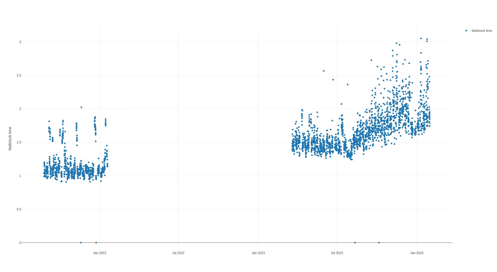

# YAML Plot Configuration

The plot configuration is a YAML file that describes the plots to be generated
from the SQLite database. Multiple plots may be overlaid on the same axes. Many
parts of the configuration is delegated to the `plotly` library, so Plotly
documentation resources and forum posts are useful for understanding these
concepts. However, the [reference documentation](https://plotly.com/javascript/) is
spotty with many options not being properly documented or only mentioned in
examples. Furthermore, we don't support every option. So in an attempt to make
things less confusing we document supported options explicitly here with a
description text which is copied from the Plotly documentation when available.

## Top-Level Configuration

| Key      | Description                               | Type                                               | Example          |
|----------|-------------------------------------------|----------------------------------------------------|------------------|
| `source` | Path to the SQLite database file.         | String                                             | `./trace.sqlite` |
| `layout` | Configuration for the layout of the plot. | [Layout Configuration](#layout-configuration)      |                  |
| `plots`  | Array of plot configurations.             | List of [Plot Configuration](#plot-configuration)s |                  |

## Layout Configuration
[Plotly layout configuration](https://plotly.com/javascript/reference/layout/).

| Key                                                                               | Description                                                                                                                                                                                                                                                                    | Type                                        | Default |
|-----------------------------------------------------------------------------------|--------------------------------------------------------------------------------------------------------------------------------------------------------------------------------------------------------------------------------------------------------------------------------|---------------------------------------------|---------|
| [`title`](https://plotly.com/javascript/reference/layout/#layout-title)           | Title configuration.                                                                                                                                                                                                                                                           | [Title Configuration](#title-configuration) |         |
| [`showlegend`](https://plotly.com/javascript/reference/layout/#layout-showlegend) | Determines whether or not a legend is drawn. Default is `true` if there is a trace to show and any of these: a) Two or more traces would by default be shown in the legend. b) One pie trace is shown in the legend. c) One trace is explicitly given with `showlegend: true`. | boolean                                     | `true`  |
| [`width`](https://plotly.com/javascript/reference/layout/#layout-width)           | Sets the plot's width (in px).                                                                                                                                                                                                                                                 | number greater than or equal to 10          | 700     |
| [`height`](https://plotly.com/javascript/reference/layout/#layout-height)         | Sets the plot's height (in px).                                                                                                                                                                                                                                                | number greater than or equal to 10          | 450     |
| `xaxis`                                                                           | Configuration for the x-axis of the plot.                                                                                                                                                                                                                                      | [Axis Configuration](#axis-configuration)   |         |
| `yaxis`                                                                           | Configuration for the y-axis of the plot.                                                                                                                                                                                                                                      | [Axis Configuration](#axis-configuration)   |         |
| `zaxis`                                                                           | Configuration for the z-axis of the plot.                                                                                                                                                                                                                                      | [Axis Configuration](#axis-configuration)   |         |
| `xaxis2`                                                                          | Configuration for the second x-axis of the plot.                                                                                                                                                                                                                               | [Axis Configuration](#axis-configuration)   |         |
| `yaxis2`                                                                          | Configuration for the second y-axis of the plot.                                                                                                                                                                                                                               | [Axis Configuration](#axis-configuration)   |         |
| `zaxis2`                                                                          | Configuration for the second z-axis of the plot.                                                                                                                                                                                                                               | [Axis Configuration](#axis-configuration)   |         |
| `xaxis3`...`xaxis8`                                                               | Configuration for the third to eighth x-axis of the plot.                                                                                                                                                                                                                      | [Axis Configuration](#axis-configuration)   |         |
| `yaxis3`...`yaxis8`                                                               | Configuration for the third to eighth y-axis of the plot.                                                                                                                                                                                                                      | [Axis Configuration](#axis-configuration)   |         |
| `zaxis3`...`zaxis8`                                                               | Configuration for the third to eighth z-axis of the plot.                                                                                                                                                                                                                      | [Axis Configuration](#axis-configuration)   |         |

## Title Configuration
[Plotly title configuration](https://plotly.com/javascript/reference/layout/#layout-title).
Currently only one configuration key is supported.

| Key                                                                         | Description                                                                                                                                                                        | Type   | Example |
|-----------------------------------------------------------------------------|------------------------------------------------------------------------------------------------------------------------------------------------------------------------------------|--------|---------|
| [`text`](https://plotly.com/javascript/reference/layout/#layout-title-text) | Sets the plot's title. Note that before the existence of `title.text`, the title's contents used to be defined as the `title` attribute itself. This behavior has been deprecated. | string | `Title` |

## Axis Configuration
[Plotly xaxis configuration](https://plotly.com/javascript/reference/layout/xaxis/). There is also [documentation for yaxis](https://plotly.com/javascript/reference/layout/yaxis/) but curiously not
for the `zaxis`. Presumably all of these are the same. At any rate, tracetool treats them all the same.

| Key                                                                                         | Description                                                                                                                                                                                                                                                                                                                                                                                                                                                                                                                                                                                | Type                                                                                                                      | Default                      | Example     |
|---------------------------------------------------------------------------------------------|--------------------------------------------------------------------------------------------------------------------------------------------------------------------------------------------------------------------------------------------------------------------------------------------------------------------------------------------------------------------------------------------------------------------------------------------------------------------------------------------------------------------------------------------------------------------------------------------|---------------------------------------------------------------------------------------------------------------------------|------------------------------|-------------|
| [`visible`](https://plotly.com/javascript/reference/layout/xaxis/#layout-xaxis-visible)     | A single toggle to hide the axis while preserving interaction like dragging. Default is true when a cheater plot is present on the axis, otherwise false.                                                                                                                                                                                                                                                                                                                                                                                                                                  | boolean                                                                                                                   |                              | `true`      |
| [`title`](https://plotly.com/javascript/reference/layout/xaxis/#layout-xaxis-title)         | Title of the axis.                                                                                                                                                                                                                                                                                                                                                                                                                                                                                                                                                                         | [Axis Title Configuration](#axis-title-configuration)                                                                     |                              |             |
| [`type`](https://plotly.com/javascript/reference/layout/xaxis/#layout-xaxis-type)           | Sets the axis type. By default, plotly attempts to determined the axis type by looking into the data of the traces that referenced the axis in question.                                                                                                                                                                                                                                                                                                                                                                                                                                   | enumerated, one of (`"-"` \| `"linear"` \| `"log"` \| `"date"` \| `"category"` \| `"multicategory"` )                     | `"-"`                        | `linear`    |
| [`autorange`](https://plotly.com/javascript/reference/layout/xaxis/#layout-xaxis-autorange) | Determines whether or not the range of this axis is computed in relation to the input data. NB: Plotly supports other options that we don't support here - we only permit `true` or `false`.                                                                                                                                                                                                                                                                                                                                                                                               | boolean                                                                                                                   | true                         | `false`     |
| [`rangemode`](https://plotly.com/javascript/reference/layout/xaxis/#layout-xaxis-rangemode) | If "normal", the range is computed in relation to the extrema of the input data. If "tozero"`, the range extends to 0, regardless of the input data If "nonnegative", the range is non-negative, regardless of the input data. Applies only to linear axes.                                                                                                                                                                                                                                                                                                                                | enumerated, one of (`"normal"` \| `"tozero"` \| `"nonnegative"`)                                                          | `"normal"`                   | `"tozero"`  |
| [`tick0`](https://plotly.com/javascript/reference/layout/xaxis/#layout-xaxis-tick0)         | Sets the placement of the first tick on this axis. Use with `dtick`. If the axis `type` is "log", then you must take the log of your starting tick (e.g. to set the starting tick to 100, set the `tick0` to 2) except when `dtick`="L<f>" (see `dtick` for more info). NB: Only numbers are supported. If the axis `type` is "date", there is no proper way to set this. If the axis `type` is "category", it should be a number, using the scale where each category is assigned a serial number from zero in the order it appears.                                                      | number                                                                                                                    |                              | `100`       |
| [`dtick`](https://plotly.com/javascript/reference/layout/xaxis/#layout-xaxis-dtick)         | Sets the step in-between ticks on this axis. Use with `tick0`. Must be a positive number. If the axis `type` is "log", then ticks are set every 10^(n"dtick) where n is the tick number. For example, to set a tick mark at 1, 10, 100, 1000, ... set dtick to 1. To set tick marks at 1, 100, 10000, ... set dtick to 2. To set tick marks at 1, 5, 25, 125, 625, 3125, ... set dtick to log_10(5), or 0.69897000433. If the axis `type` is "date", then you must convert the time to milliseconds. For example, to set the interval between ticks to one day, set `dtick` to 86400000.0. | number                                                                                                                    |                              | `100`       |
| [`showgrid`](https://plotly.com/javascript/reference/layout/xaxis/#layout-xaxis-showgrid)   | Determines whether or not grid lines are drawn. If "true", the grid lines are drawn at every tick mark.                                                                                                                                                                                                                                                                                                                                                                                                                                                                                    | boolean                                                                                                                   |                              | `true`      |
| [`side`](https://plotly.com/javascript/reference/layout/xaxis/#layout-xaxis-side)           | Determines whether a x (y) axis is positioned at the "bottom" ("left") or "top" ("right") of the plotting area.                                                                                                                                                                                                                                                                                                                                                                                                                                                                            | enumerated, one of (`"top"` \| `"bottom"` \| `"left"` \| `"right"`)                                                       |                              | `"top"`     |
| [`overlaying`](https://plotly.com/javascript/reference/layout/xaxis/#layout-xaxis-overlaying) |If set a same-letter axis id, this axis is overlaid on top of the corresponding same-letter axis, with traces and axes visible for both axes. If "false", this axis does not overlay any same-letter axes. In this case, for axes with overlapping domains only the highest-numbered axis will be visible.| enumerated , one of ( `"free"` \| `"/^x([2-9]\|[1-9][0-9]+)?( domain)?$/"` \| `"/^y([2-9]\|[1-9][0-9]+)?( domain)?$/"` ) |            | `x2 domain` |

## Plot Configuration
### Common Plot Configuration

| Key                                                                           | Description                                                                                                                                                                                                                                                                                                   | Type                                                                                        | Example                                                                    |
|-------------------------------------------------------------------------------|---------------------------------------------------------------------------------------------------------------------------------------------------------------------------------------------------------------------------------------------------------------------------------------------------------------|---------------------------------------------------------------------------------------------|----------------------------------------------------------------------------|
| `plot`                                                                        | Type of the plot.                                                                                                                                                                                                                                                                                             | enumeration, one of (`"time_scatter"` \| `"count_scatter"` \| `"overlap"`)                  | `"time_scatter"`                                                             |
| `filter`                                                                      | Filter to apply to the data.                                                                                                                                                                                                                                                                                  | Object                                                                                      | See [Filter Configuration](#filter-configuration)                          |
| `aggregation`                                                                 | Aggregation to apply to the data.                                                                                                                                                                                                                                                                             | Object                                                                                      | See [Aggregation Configuration](#aggregation-configuration)                |
| [`name`](https://plotly.com/javascript/reference/scatter/#scatter-name)       | Name of the plot.                                                                                                                                                                                                                                                                                             | String                                                                                      | `"View performance"`                                                         |
| [`visible`](https://plotly.com/javascript/reference/scatter/#scatter-visible) | Determines whether or not this trace is visible. If "legendonly", the trace is not drawn, but can appear as a legend item (provided that the legend itself is visible).                                                                                                                                       | enumerated , one of ( `true` \| `false` \| `"legendonly"` )                                 | `"legendonly"`                                                             |
| [`mode`](https://plotly.com/javascript/reference/scatter/#scatter-mode)       | Determines the drawing mode for this trace. If the provided `mode` includes "text" then the `text` elements appear at the coordinates. Otherwise, the `text` elements appear on hover. If there are less than 20 points and the trace is not stacked then the default is "lines+markers". Otherwise, "lines". | flaglist string. Any combination of "lines", "markers", "text" joined with a "+" OR "none". | `"lines"`, `"markers"`, `"lines+markers"`, `"lines+markers+text"`, `"none"` |
| [`line`](https://plotly.com/javascript/reference/scatter/#scatter-line)       | Configuration for the lines in the plot.                                                                                                                                                                                                                                                                      | [Line Configuration](#line-configuration)                                                   |                                                                            |
| [`xaxis`](https://plotly.com/javascript/reference/scatter/#scatter-xaxis)     | Sets a reference between this trace's x coordinates and a 2D cartesian x axis. If "x" (the default value), the x coordinates refer to `layout.xaxis`. If "x2", the x coordinates refer to `layout.xaxis2`, and so on.                                                                                         | subplotid                                                                                   | `"x"`                                                                        |
| [`yaxis`](https://plotly.com/javascript/reference/scatter/#scatter-yaxis)     | Sets a reference between this trace's y coordinates and a 2D cartesian y axis. If "y" (the default value), the y coordinates refer to `layout.yaxis`. If "y2", the y coordinates refer to `layout.yaxis2`, and so on.                                                                                         | subplotid                                                                                   | `"y"`                                                                        |

### Time Scatter Plot Configuration (`time_scatter`)

This plot type is a scatter plot from a table where the x-axis is the timestamp
and the y-axis is a duration value from a selected table column.

| Key      | Description                         | Type                                                                                                   | Example                      |
|----------|-------------------------------------|--------------------------------------------------------------------------------------------------------|------------------------------|
| `table`  | Database table to use for the plot. | String                                                                                                 | `"item_view_executor_execute"` |
| `column` | Column to use for the y-axis.       | String                                                                                                 | `"wallclock_time_ns"`          |
| `unit`   | Unit of the y-axis.                 | enumeration, one of (`"Y"` \| `"M"` \| `"W"` \| `"h"` \| `"m"` \| `"s"` \| `"ms"` \| `"us"` \| `"ns"`) | `"ns"`                       |

### Count Scatter Plot Configuration (`count_scatter`)

This plot type is a scatter plot from a table where the x-axis is the timestamp
and the y-axis is column in the table which is interpreted as a count (as
opposed to a duration, in a `time_scatter` plot).

| Key      | Description                         | Type                                                                                                   | Example                      |
|----------|-------------------------------------|--------------------------------------------------------------------------------------------------------|------------------------------|
| `table`  | Database table to use for the plot. | String                                                                                                 | `"item_view_executor_execute"` |
| `column` | Column to use for the y-axis.       | String                                                                                                 | `"wallclock_time_ns"`          |

### Overlap Plot Configuration (`overlap`)

The `overlap` plot type creates a heatmap that visualizes the correlation
between execution time of a view and the overlap with execution of other views.
Before generating this plot, the `item_view_executor_execute_overlap` table must
be created using the `compute-overlap` command. The plot is a 2D histogram of
the execution time of the view on the x-axis, and the overlap percentage with
other views on the y-axis.

| Key       | Description                         | Type    | Example |
|-----------|-------------------------------------|---------|---------|
| `view_id` | ID of the view to use for the plot. | integer | `123`   |
| `x_bins`  | Number of bins for the x-axis.      | integer | `100`   |
| `y_bins`  | Number of bins for the y-axis.      | integer | `100`   |

### Filter Configuration
The filter will be applied to the data before plotting, to decide which samples to include.

| Key         | Description                                                                                                                                                                                                                                                                                       | Type     | Example                                           |
|-------------|---------------------------------------------------------------------------------------------------------------------------------------------------------------------------------------------------------------------------------------------------------------------------------------------------|----------|---------------------------------------------------|
| `start`     | Start time for the filter.                                                                                                                                                                                                                                                                        | datetime | `"2023"`, `"2023-05-24"`, `"2023-05-24 15:43:16"` |
| `end`       | End time for the filter.                                                                                                                                                                                                                                                                          | datetime | `"2023"`, `"2023-05-24"`, `"2023-05-24 15:43:16"` |
| `where`     | Additional arbitrary SQL WHERE clause, as understood by SQLite.                                                                                                                                                                                                                                   | String   | `"view_id = 123"`                                 |
| `workhours` | Whether to only include samples within work hours. This means that each sample's timestamp will be converted to local time, and if it does not occur between 08:00 and 17:00 on a weekday, it is discarded. This is useful for removing outliers that occur when few people are using the system. | Boolean  | `true`                                            |

### Aggregation Configuration
Aggregation will be applied to the data before plotting, to group samples into
bins and then compute a single value for each bin.

| Key    | Description                                                                                                 | Type                                                                                              | Example                |
|--------|-------------------------------------------------------------------------------------------------------------|---------------------------------------------------------------------------------------------------|------------------------|
| `mode` | Mode of the aggregation.                                                                                    | enumeration, one of (`"mean"` \| `"min"` \| `"q1"` \| `"median"` \| `"q3"` \| `"max"`, `"count"`) | `"mean"`               |
| `size` | Size of the aggregation as a time duration. Duration units larger than day (`D`) are currently unsupported. | time period                                                                                       | `"3h"`, `"1D"`, `"5m"` |

### Line Configuration
[Plotly line configuration](https://plotly.com/javascript/reference/scatter/#scatter-line).

| Key                                                                                    | Description                                                                                                                                                                                                                                                                                                                                                                                                                                                                                                                                                                                                                                                                                     | Type                                                                                                    | Default    | Example     |
|----------------------------------------------------------------------------------------|-------------------------------------------------------------------------------------------------------------------------------------------------------------------------------------------------------------------------------------------------------------------------------------------------------------------------------------------------------------------------------------------------------------------------------------------------------------------------------------------------------------------------------------------------------------------------------------------------------------------------------------------------------------------------------------------------|---------------------------------------------------------------------------------------------------------|------------|-------------|
| [`width`](https://plotly.com/javascript/reference/scatter/#scatter-line-width)         | Sets the line width (in px).                                                                                                                                                                                                                                                                                                                                                                                                                                                                                                                                                                                                                                                                    | number greater than or equal to 0                                                                       | `2`        | `5`         |
| [`shape`](https://plotly.com/javascript/reference/scatter/#scatter-line-shape)         | Determines the line shape. With "spline" the lines are drawn using spline interpolation. The other available values correspond to step-wise line shapes.                                                                                                                                                                                                                                                                                                                                                                                                                                                                                                                                        | enumerated, one of (`"linear"` \| `"spline"` \| `"hv"` \| `"vh"` \| `"hvh"` \| `"vhv"`)                 | `"linear"` | `"spline"`  |
| [`smoothing`](https://plotly.com/javascript/reference/scatter/#scatter-line-smoothing) | Has an effect only if `shape` is set to "spline" Sets the amount of smoothing. "0" corresponds to no smoothing (equivalent to a "linear" shape).                                                                                                                                                                                                                                                                                                                                                                                                                                                                                                                                                | number between or equal to 0 and 1.3                                                                    | `1`        | `0.3`       |
| [`dash`](https://plotly.com/javascript/reference/scatter/#scatter-line-dash)           | Sets the dash style of lines. Set to a dash type string ("solid", "dot", "dash", "longdash", "dashdot", or "longdashdot").                                                                                                                                                                                                                                                                                                                                                                                                                                                                                                                                                                      | enumerated, one of (`"solid"` \| `"dot"` \| `"dash"` \| `"longdash"` \| `"dashdot"` \| `"longdashdot"`) | `"solid"`  | `"dot"`     |
| [`simplify`](https://plotly.com/javascript/reference/scatter/#scatter-line-simplify)   | Simplifies lines by removing nearly-collinear points. When transitioning lines, it may be desirable to disable this so that the number of points along the resulting SVG path is unaffected.                                                                                                                                                                                                                                                                                                                                                                                                                                                                                                    | boolean                                                                                                 | `true`     | `false`     |
| [`color`](https://plotly.com/javascript/reference/scatter/#scatter-line-color)         | Sets the line color.                                                                                                                                                                                                                                                                                                                                                                                                                                                                                                                                                                                                                                                                            | color                                                                                                   |            | `"red"`     |
| `cauto`                                                                                | Determines whether or not the color domain is computed with respect to the input data or the bounds set in `cmin` and `cmax`. Defaults to `false` when `cmin` and `cmax` are set by the user.                                                                                                                                                                                                                                                                                                                                                                                                                                                                                                   | boolean                                                                                                 |            | `false`     |
| `cmin`                                                                                 | Sets the lower bound of the color domain. Value should have the same units as in `color`.                                                                                                                                                                                                                                                                                                                                                                                                                                                                                                                                                                                                       | number                                                                                                  |            |             |
| `cmax`                                                                                 | Sets the upper bound of the color domain. Value should have the same units as in `color`.                                                                                                                                                                                                                                                                                                                                                                                                                                                                                                                                                                                                       | number                                                                                                  |            | `           |
| `cmid`                                                                                 | Sets the mid-point of the color domain by scaling `cmin` and/or `cmax` to be equidistant to this point.                                                                                                                                                                                                                                                                                                                                                                                                                                                                                                                                                                                         | number                                                                                                  |            | `           |
| `colorscale`                                                                           | Sets the colorscale. Has an effect only if in `marker.line.color` is set to a numerical array. The colorscale must be an array containing arrays mapping a normalized value to an rgb, rgba, hex, hsl, hsv, or named color string. At minimum, a mapping for the lowest (0) and highest (1) values are required. For example, `[[0, 'rgb(0,0,255)'], [1, 'rgb(255,0,0)']]`. To control the bounds of the colorscale in color space, use `marker.line.cmin` and `marker.line.cmax`. Alternatively, `colorscale` may be a palette name string of the following list: Blackbody,Bluered,Blues,Cividis,Earth,Electric,Greens,Greys,Hot,Jet,Picnic,Portland,Rainbow,RdBu,Reds,Viridis,YlGnBu,YlOrRd. | colorscale                                                                                              |            | `"Viridis"` |
| `autocolorscale`                                                                       | Determines whether the colorscale is a default palette (`autocolorscale: true`) or the palette determined by `colorscale`. Has an effect only if in `color` is set to a numerical array. In case `colorscale` is unspecified or `autocolorscale` is true, the default palette will be chosen according to whether numbers in the `color` array are all positive, all negative or mixed.                                                                                                                                                                                                                                                                                                         | boolean                                                                                                 | `true`     | `false`     |
| `reversescale`                                                                         | Reverses the color mapping if true. Has an effect only if in `marker.line.color` is set to a numerical array. If true, `cmin` will correspond to the last color in the array and `cmax` will correspond to the first color.                                                                                                                                                                                                                                                                                                                                                                                                                                                                     | boolean                                                                                                 | `false`    | `true`      |
| `outliercolor`                                                                         | Sets the border line color of the outlier sample points. Defaults to `color`                                                                                                                                                                                                                                                                                                                                                                                                                                                                                                                                                                                                                    | color                                                                                                   |            | `"red"`     |
| `outlierwidth`                                                                         | Sets the border line width (in px) of the outlier sample points.                                                                                                                                                                                                                                                                                                                                                                                                                                                                                                                                                                                                                                | color                                                                                                   | `1`        | `5`         |
